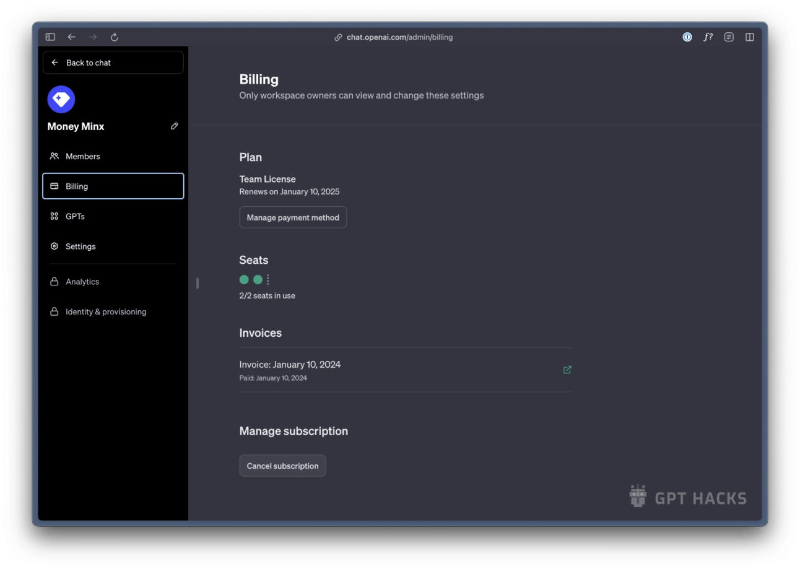
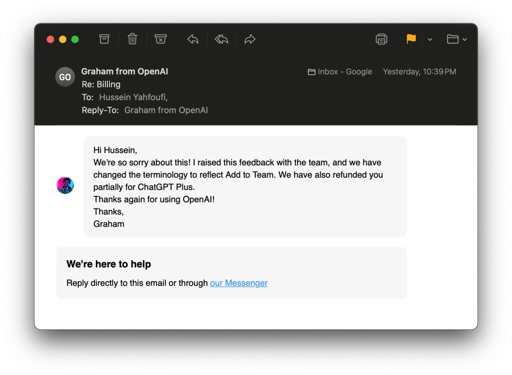

# ChatGPT团队版值不值得买?一个真实用户的使用报告

---

你可能也在考虑这个问题——ChatGPT团队版到底值不值得升级?

自从OpenAI推出团队版以来,我收到最多的问题就是这个。说实话,这个问题没有标准答案,得看你的具体情况。不过我可以分享一下我的真实体验:我在团队版上线第一天就订阅了,试用到现在,我决定继续用下去。

让我来拆解一下ChatGPT团队版到底提供了什么功能,以及它适合哪些人。顺便,文章最后我会讲一个小插曲——我怎么帮OpenAI发现了一个产品bug。

---

## ChatGPT团队版包含哪些功能?

简单说就三点:

1. 包含ChatGPT Plus的全部功能
2. 你的对话数据不会被用来训练模型
3. 团队工作区管理功能(目前比较基础,但会不断完善)

具体来看:

**第一,你和团队成员都能用上ChatGPT Plus的全部能力:**

- 使用最新的模型,提前体验新功能
- 更快的响应速度,优先访问权限,高峰期不会被挤掉(说实话,我现在很少遇到用不了的情况)
- 访问GPT商店里的各种定制GPT
- 使用DALL·E图像生成、网页浏览、高级数据分析等工具

**第二,这是我续订的主要原因:对话内容不会被用来训练OpenAI的模型。**如果你或团队在工作中使用ChatGPT,这就多了一层数据保护。👉 [需要稳定安全的ChatGPT团队协作环境?点击查看高性价比方案](https://shaoyumi.com/buy/65)

**注意**:这不代表你可以在ChatGPT里分享公司机密。风险依然存在,只是模型不会拿你的数据去训练而已。

**第三,你能访问一个新的工作区设置区域。**在这里可以管理团队成员、账单、控制GPT访问权限等。目前功能还比较简单,但我估计很快会有更多功能上线。

## ChatGPT团队版多少钱?

按月付费:每人每月30美元
按年付费:每人每月25美元

最少需要2个用户才能使用团队版。

作为对比,ChatGPT Plus个人版是每月20美元。

## 你应该升级到ChatGPT团队版吗?

如果你还在用免费版ChatGPT,升级到Plus版(每月20美元)是绝对值得的。无论个人用还是工作用,我都强烈推荐。

至于团队版,目前只有一种情况特别适合:你在工作中使用ChatGPT,并且想要额外的隐私保护——也就是确保模型不会用你的对话数据训练。对这类用户来说,👉 [选择一个靠谱的ChatGPT团队账号渠道很关键](https://shaoyumi.com/buy/65),能省去不少后顾之忧。

## OpenAI的一个小失误(以及我是怎么帮他们改进的)

这个故事挺有意思,也能给做产品的人一些启发。

ChatGPT团队版刚推出时,我在ChatGPT里看到一条消息问我要不要"升级到团队账号"(upgrade to a teams account)。我就点了升级。结果几天后发现,我的Plus账号还在继续扣费。我赶紧联系OpenAI团队告诉他们这个问题。

虽然我肯定不是唯一一个发现这个问题的人,但他们确实很快做了调整。现在的文案改成了"创建团队工作区"(create a team workspace),而不是"升级账号"。他们还加了一个功能,可以把我的Plus账号和新的团队账号合并。

这件事的教训是:行动按钮(CTA)的文案真的很重要,用词不准确会造成困扰。另外也要给OpenAI点个赞,反应够快。

---

## 结语

说到底,ChatGPT团队版适不适合你,取决于你的使用场景。如果你经常在工作中用ChatGPT处理敏感内容,想要更安心的数据保护,那团队版就是个不错的选择。这也是为什么像[ChatGPT团队版这样的账号服务](https://shaoyumi.com/buy/65)对需要稳定协作的团队来说特别实用——它解决的不只是功能问题,更是信任和效率的问题。
